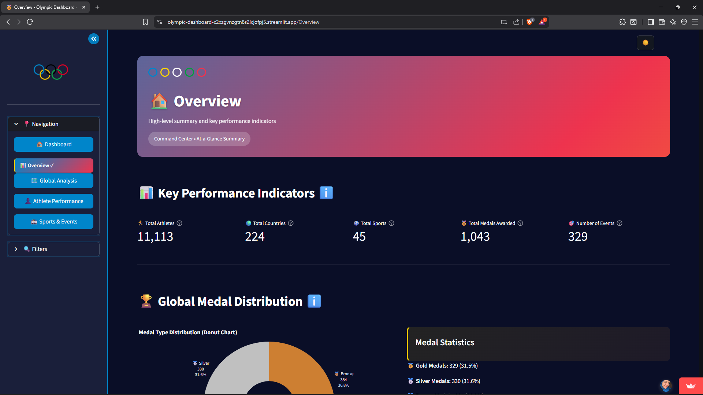
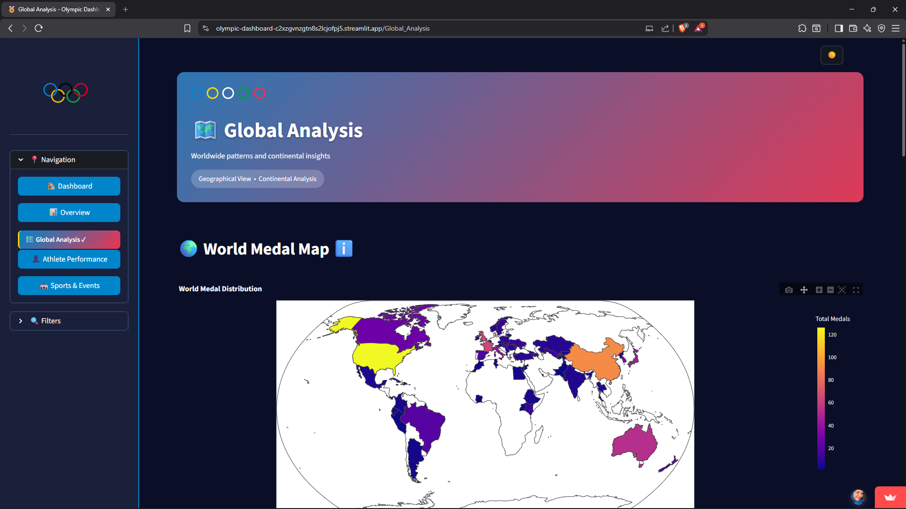
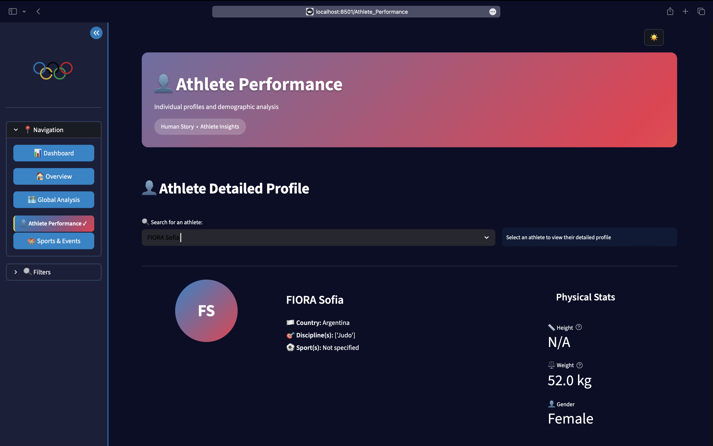
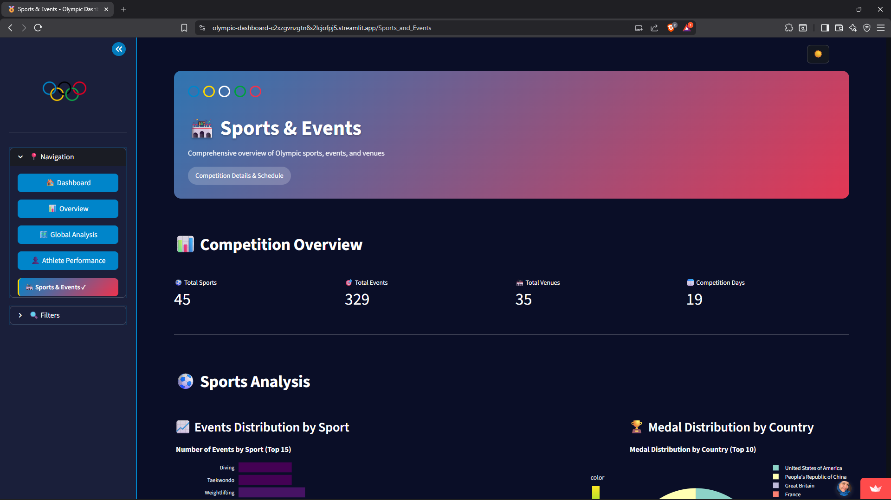
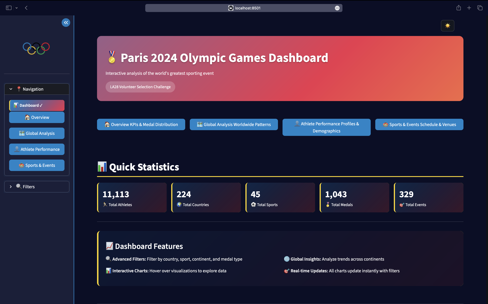

# 🏅 LA28 Olympic Games Dashboard

## Overview
Interactive Streamlit dashboard for analyzing Paris 2024 Olympic Games data, built for the LA28 Volunteer Selection Challenge. Features multi-page analysis, advanced visualizations, and real-time filtering.


## 📍 Live Demo
👉 **Live Application**: https://olympic-dashboard-c2xzgvnzgtn8s2lcjofpj5.streamlit.app/

## 📸 Screenshots

### 1. 🏠 Overview Page
Key Performance Indicators and global medal distribution


### 2. 🗺️ Global Analysis Page
Interactive world map with choropleth visualization


### 3. 👤 Athlete Performance Page
Detailed athlete profiles and demographic analysis


### 4. 🏟️ Sports & Events Page
Event schedule and venue locations


### 5. Dashboard Theme
Light and dark theme toggle functionality


## Features
- **4 Analysis Pages**: Overview, Global Analysis, Athlete Performance, Sports & Events
- **Advanced Visualizations**: Choropleth maps, treemaps, Gantt charts, sunburst diagrams
- **Interactive Filters**: Country, sport, continent, and medal type filters
- **Athlete Profiles**: Searchable athlete profiles with detailed stats
- **Event Scheduling**: Gantt charts for Olympic event timelines
- **Responsive Design**: Works across desktop and tablet devices

## Quick Start

### 1. Prerequisites
- Python 3.8+
- Git

### 2. Installation
```bash
# Clone repository
git clone https://github.com/sarrazer24/olympic-dashboard.git
cd olympic-dashboard

# Create virtual environment (optional)
python -m venv venv
source venv/bin/activate  # On Windows: venv\Scripts\activate

# Install dependencies
pip install -r requirements.txt
```

### 3. Data Setup
1. Download dataset from [Kaggle - Paris 2024 Olympic Summer Games](https://www.kaggle.com/datasets/piterfm/paris-2024-olympic-summer-games)
2. Place all CSV files in the `data/` directory
3. Required files: `medals_total.csv`, `athletes.csv`, `events.csv`, `venues.csv`, etc.

### 4. Run Application
```bash
streamlit run app.py
```

## Project Structure
```
olympic-dashboard/
├── app.py                    # Main application entry point
├── pages/                    # Dashboard pages
│   ├── 1_🏠_Overview.py
│   ├── 2_🗺️_Global_Analysis.py
│   ├── 3_👤_Athlete_Performance.py
│   └── 4_🏟️_Sports_and_Events.py
├── data/                     # CSV dataset files
├── figures/                  # Images and logos
├── requirements.txt          # Python dependencies
├── styles.py                # Theme and CSS management
└── README.md
```

## Pages Overview

### 1. 🏠 Overview
- Key Performance Indicators (KPIs)
- Global medal distribution
- Top performing countries

### 2. 🗺️ Global Analysis
- Interactive world medal map (choropleth)
- Continent vs. medals analysis
- Medal hierarchy visualizations

### 3. 👤 Athlete Performance
- Searchable athlete profiles
- Age and gender distribution analysis
- Top athletes by medals

### 4. 🏟️ Sports & Events
- Event schedule Gantt chart
- Venue location mapping
- Sport-specific medal analysis

## 👥 Team
**Soummar Inas** - i.soummar@esi-sba.dz  
**Zerguerras Khayra Sarra** - ks.zerguerras@esi-sba.dz

*Note: Both team members contributed equally to all aspects of the project including data analysis, visualization development, UI/UX design, and implementation.*

## Deployment
The application is deployed on **Streamlit Cloud**: https://olympic-dashboard-c2xzgvnzgtn8s2lcjofpj5.streamlit.app/

To deploy your own version:
1. Fork this repository
2. Go to [share.streamlit.io](https://share.streamlit.io)
3. Connect your GitHub repository and deploy

## Troubleshooting
- **Missing CSV files**: Ensure all required CSV files are in the `data/` directory
- **Module errors**: Run `pip install -r requirements.txt`
- **Blank charts**: Check CSV files contain data in expected columns
- **Theme issues**: Clear browser cache and restart app

## Built For
**LA28 Volunteer Selection Challenge**  
**Instructor**: Dr. Belkacem KHALDI  
**Institution**: ESI SBA (École Supérieure en Informatique - Sidi Bel Abbès)

---

*For questions or issues, please contact either team member via email.*